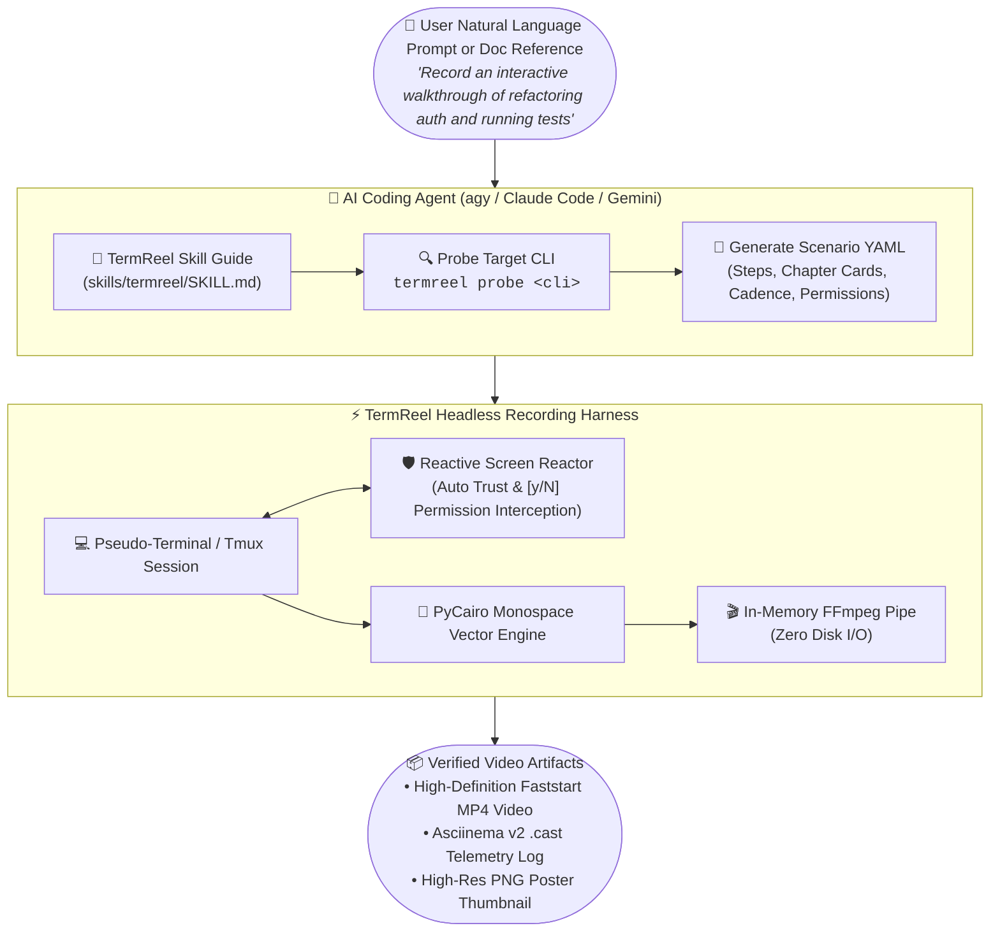

# TermReel

[](https://github.com/pauldatta/termreel/actions/workflows/ci.yml)
[](https://pauldatta.github.io/termreel/)
[](LICENSE)
[](https://www.python.org/downloads/)
[](https://astral.sh/uv)

**TermReel** (`termreel` / `reccli`) is a standalone, headless CLI recording harness and deterministic video synthesis engine. It drives interactive CLI tools, TUIs, and autonomous AI coding agents (`agy`, `git`, `gcloud`, `gh`, `kubectl`, `vim`, etc.) inside real pseudo-terminals (PTY/tmux), injects natural human keystrokes, reacts to live screen events, and streams pixel-perfect H.264 MP4/WebM videos, animated GIFs, and Asciinema v2 (`.cast`) event streams directly into FFmpeg with **zero intermediate disk I/O**.

---

## Key Features

| Subsystem | Capability | Architectural Benefit |
| :--- | :--- | :--- |
| **Terminal Emulation** | 2D cell grid, 24-bit TrueColor RGB, ANSI 256-color, alternate screen buffers (`1049h/l`). | Pixel-accurate reproduction of modern TUIs with incremental UTF-8 character stream decoding. |
| **PTY & Session Supervision** | POSIX `openpty()` and isolated `tmux` backend drivers with SIGWINCH propagation. | Executes real interactive binaries without requiring non-interactive print modes (`-p`). |
| **Reactive Screen Reactor** | Dynamic regex trigger engine with async keystroke dispatch. | Intercepts modal workspace trust prompts and `[y/N]` human approval dialogs automatically. |
| **Vector Rendering** | PyCairo sub-pixel font rasterizer with monospace text run batching. | 85–90% reduction in draw calls; crisp typography across 9 calibrated color palettes. |
| **Stream Transcoder** | Direct raw BGRA vector pipe to FFmpeg stdin with async background stderr draining. | Zero intermediate disk I/O; deadlock-free streaming with timed process reaping. |
| **CLI Explorer & Scaffolding**| Binary probing for subcommands, usage, and security permission boundaries. | Auto-scaffolds validated scenario YAML manifests (`termreel probe` / `termreel generate`). |
| **Session Resumption** | Multi-stage workflow checkpointing via `--resume` / `-c` and conversation ID tracking. | Seamlessly attaches to existing agent sessions without restarting the workspace. |
| **Telemetry & Redaction** | Asciinema v2 (`.cast`) capture, PNG poster frame extraction, and automated token masking. | Lightweight audit logging with automated credential and secret masking. |

---

## 🤖 Using TermReel with AI Agents (`agy`, Claude Code, Gemini CLI)

TermReel includes an **Agent Skill** (`skills/termreel/SKILL.md` / `.agents/skills/termreel/SKILL.md`) that allows AI coding assistants to automatically script, record, and verify terminal videos directly from your high-level instructions.



### 1. Zero-YAML Prompting: Prompt in Plain English
You do not need to write YAML by hand. You can instruct your AI assistant in natural language:

> *"Record a high-quality video showing how to initialize a Git repo, create a python script, and inspect the branch graph using TermReel in the tokyo-night theme."*

### 2. Document & PR-Driven Video Generation
Point your agent to a Google Doc, Markdown design spec, or GitHub pull request:

> *"Read `@docs/feature_spec.md` and record a 720p interactive walkthrough demonstrating the new CLI flags and test verification."*

The agent reads the document using its file/search tools, references the TermReel Skill, maps the workflow into structured timeline steps (`show_card`, `launch`, `type`, `wait_for_idle`, `run_shell`), executes `termreel record`, and returns the completed video artifact.

---

## Installation

### 1. One-Line Binary Installer (Recommended for Users)
Installs the standalone pre-compiled binary directly to `~/.local/bin/termreel` (zero Python setup required):

```bash
curl -fsSL https://raw.githubusercontent.com/pauldatta/termreel/main/install.sh | bash
```

### 2. Fast Isolated Installation with `uv` (Recommended for Developers)
If you use [uv](https://astral.sh/uv), install TermReel into an isolated global environment in milliseconds:

```bash
uv tool install git+https://github.com/pauldatta/termreel.git
```

Or run TermReel ephemerally without installing:

```bash
uvx --from git+https://github.com/pauldatta/termreel.git termreel probe git
```

### 3. From Source
```bash
git clone https://github.com/pauldatta/termreel.git
cd termreel
uv pip install -e .
```

*Note: TermReel requires `ffmpeg` on your `$PATH` for video stream encoding (`brew install ffmpeg` on macOS or `sudo apt install ffmpeg` on Ubuntu/Debian).*

---

## Quickstart

```bash
# 1. Explore CLI subcommands and security capabilities
termreel probe git

# 2. Scaffold a tailored scenario YAML
termreel generate git -o scenarios/git_demo.yaml --theme tokyo-night

# 3. Record the high-fidelity video
termreel record scenarios/git_demo.yaml -o output/git_demo.mp4

# 4. Direct one-shot recording
termreel exec "git status" -o output/status.mp4 --theme nord

# 5. Transcode Asciinema cast to MP4
termreel cast2video session.cast -o session.mp4 --theme dracula

# 6. Resume an ongoing session or conversation
termreel record scenarios/git_demo.yaml --resume

# 7. Run full test suite in parallel
termreel test -w 8
```

---

## Sample Scenario Manifest

```yaml
version: "1.0"

metadata:
  title: "Git Workflow Masterclass"
  subtitle: "Staging, Commit Hygiene & Graph Inspection"
  output: "output/git_workflow.mp4"
  poster_output: "output/git_workflow_poster.png"
  resolution: [1280, 720]
  fps: 30
  theme: "tokyo-night"
  statusbar_left: "Git v2.55 | main | clean"
  statusbar_right: "TermReel HD"

environment:
  create_temp_workspace: true

timeline:
  - show_card:
      tag: "Module 1"
      title: "Interactive Git Workflow"
      desc: "Simulating human typing cadence with TrueColor logs"
      duration: 2.0

  - launch:
      command: "bash"

  - run_shell:
      command: "git status"
      pause: 1.2

  - run_shell:
      command: "git log --graph --oneline --decorate"
      pause: 2.0

  - show_card:
      tag: "Complete"
      title: "Workflow Mastered"
      duration: 1.5
```

---

## Documentation

Comprehensive guides, architecture design documents, and scenario walkthroughs are available at **[https://pauldatta.github.io/termreel/](https://pauldatta.github.io/termreel/)**:

- [System Architecture (TR-SDD-001)](docs/architecture.md)
- [Long-Running Resilience (TR-SDD-002)](docs/SDD_LONG_RUNNING_RESILIENCE.md)
- [CLI Reference & Commands](docs/cli.md)
- [Scenario Manifest Specification](docs/scenarios.md)
- [Recording Interactive AI Agents](docs/interactive-agents.md)
- [CLI Explorer & Generator](docs/generator.md)
- [Themes & Custom Window Chrome](docs/themes.md)
- [Example Scenarios](docs/examples/antigravity.md)

---

## Contributing

Contributions are welcome! Please review our [Contribution Guide](CONTRIBUTING.md) for development workflows, testing guidelines, and code standards.

---

## License

TermReel is open-source software licensed under the [Apache-2.0 License](LICENSE).
