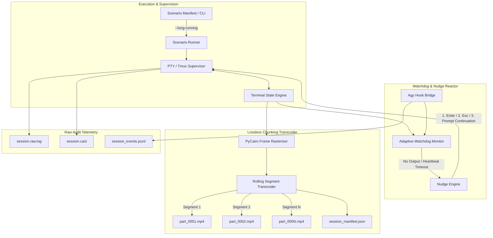
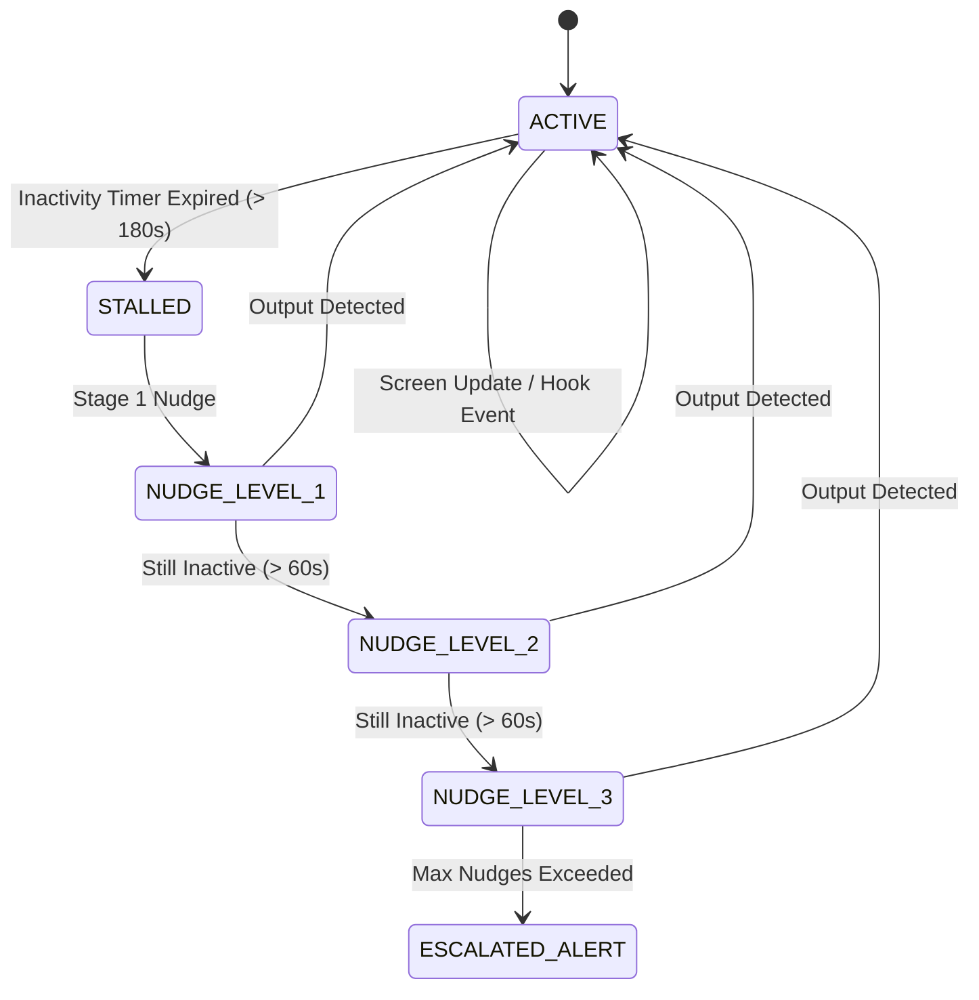

# Software Design Document: Long-Running Agent Resilience, Watchdog Nudging, Rolling Chunk Transcoder & Audit Telemetry

- **Document ID**: TR-SDD-002
- **Title**: Long-Running Resilience & Adaptive Recording Engine
- **Author**: Paul Datta (`pkdatta2000@gmail.com`)
- **Status**: Proposed / Approved for Implementation
- **Version**: 1.0.0
- **Target Subsystems**: `termreel.reactor`, `termreel.transcoder`, `termreel.supervisor`, `termreel.utils`, `termreel.scenario`

---

## 1. Executive Summary & Problem Statement

Autonomous AI coding agents (such as Google Antigravity `agy`, Gemini CLI, Claude Code, and multi-agent teams) increasingly operate over long horizons—executing multi-step code refactoring, full-stack migrations, large test suites, and multi-repository tasks that can span anywhere from **15 minutes to 6+ hours**.

Because execution duration cannot always be predicted in advance, conventional continuous video recording harnesses encounter three critical failure modes:

1. **Unbounded Disk Consumption & ENOSPC Failures**: Keeping a single monolithic FFmpeg stdin pipe open for 4+ hours at 30 FPS consumes tens of gigabytes of disk and risk crashing the host environment due to out-of-space (`ENOSPC`) or corrupted container files if abruptly terminated.
2. **Silent Agent Freezes & Stalled State Loops**: Agents occasionally hang due to unhandled terminal paging (e.g. `less` / `git log` waiting on `q`), subshell lockups, model token timeouts, or modal prompts that missed a trigger. Without active heartbeat nudging, the harness records hours of dead air.
3. **Auditability & Verification Gaps**: Video files alone are difficult to index, grep, or mathematically verify. A lossless textual and event-driven audit stream is required for compliance, debugging, and post-mortem evaluation.

This document specifies the architectural design for the **Long-Running Resilience Engine** in TermReel, introducing the `--long-running` flag, adaptive watchdog nudging, rolling chunked transcoders with disk quota guards, and dual-track audit logging.

---

## 2. Architectural Overview



---

## 3. Subsystem 1: The Adaptive `--long-running` Engine

### 3.1 Scenario Manifest & CLI Flag
Users and agents can activate long-running resilience via the CLI flag `--long-running` or through the scenario manifest:

```bash
termreel record scenarios/full_migration.yaml --long-running --max-disk 5GB
```

```yaml
version: "1.0"

metadata:
  title: "Full-Stack Migration Agent"
  output: "output/migration_session.mp4"
  long_running:
    enabled: true
    heartbeat_timeout_sec: 180.0       # Trigger nudge if no screen activity or hook event in 3m
    max_nudges_per_step: 3              # Escalate after 3 unacknowledged nudges
    nudge_strategy: "adaptive"          # "enter" -> "escape" -> "continuation_prompt"
    segment_duration_min: 15            # Split video into 15-minute losslessly stitchable chunks
    max_disk_mb: 4096                   # Hard disk quota ceiling (4 GB)
    disk_exhaustion_action: "compress_prior_chunks" # "compress_prior_chunks" | "halt" | "telemetry_only"
    audit_log: "output/migration.raw.log"
    events_log: "output/migration.events.jsonl"
```

---

## 4. Subsystem 2: Watchdog Reactor & Adaptive Agent Nudging

### 4.1 Inactivity & Freeze Detection Algorithm
The watchdog runs as a lightweight daemon thread evaluating two independent heartbeat sources:
1. **Screen Buffer Hash Invalidation**: Has the visible terminal grid changed within `heartbeat_timeout_sec`?
2. **Lifecycle Hook Telemetry**: Has `AgyHookBridge` received any `PreToolUse`, `PostToolUse`, or `PostInvocation` events?

If neither the screen nor the hook bridge emits an event within the timeout threshold, the session enters the `STALLED` state.



### 4.2 Progressive Nudge Escalation Matrix

| Nudge Level | Trigger Condition | Injected Action | Rationale |
| :--- | :--- | :--- | :--- |
| **Level 1 (Soft Enter)** | Inactive for `T` seconds | Injects `\r` (`Enter`) | Awaken idle readline prompts, confirm unsubmitted input |
| **Level 2 (Pager Escape)** | Inactive for `T + 60s` | Injects `q` followed by `\x1b` (`Escape`) | Unstick accidental pager/less/man traps or modal popovers |
| **Level 3 (AI Continuation)** | Inactive for `T + 120s` | Types `"Please continue with the remaining task steps"` + `Enter` | Re-engages stalled LLM reasoning loop or stuck conversation turn |
| **Level 4 (SIGWINCH Pulse)** | Inactive for `T + 180s` | Sends terminal resize pulse `ioctl(TIOCSWINSZ)` | Forces curses/Textual/Bubbletea TUI redraw |
| **Level 5 (Escalation)** | Inactive for `T + 240s` | Logs warning to audit file and marks step timed out | Graceful scenario termination without data loss |

---

## 5. Subsystem 3: Rolling Lossless Segment Transcoder

To guarantee that long-running recordings never cause disk exhaustion (`ENOSPC`) or data corruption, TermReel replaces the single monolithic FFmpeg process with a **Rolling Segment Transcoder**.

### 5.1 Rolling Segment Architecture
- **Chunk Partitioning**: Video is segmented every `N` minutes (e.g. 15 or 30 minutes) into self-contained, valid MP4 containers (`segment_0001.mp4`, `segment_0002.mp4`, ...).
- **Zero-Loss Keyframe Alignment**: FFmpeg segmenter ensures clean IDR keyframe boundary transitions.
- **Dynamic Manifest (`session_manifest.json`)**: Tracks segment start/end timestamps, frame counts, byte sizes, and active chapter tags.

```json
{
  "session_id": "tr_session_20260829_051500",
  "title": "Full-Stack Migration Agent",
  "total_duration_sec": 7200.0,
  "total_frames": 216000,
  "segments": [
    {
      "index": 1,
      "file": "segment_0001.mp4",
      "duration_sec": 900.0,
      "frames": 27000,
      "size_bytes": 45120400,
      "chapter": "Module 1: Codebase Discovery"
    },
    {
      "index": 2,
      "file": "segment_0002.mp4",
      "duration_sec": 900.0,
      "frames": 27000,
      "size_bytes": 51200300,
      "chapter": "Module 2: Automated Refactoring"
    }
  ]
}
```

### 5.2 Disk Quota & Graceful Fallback Modes
The transcoder actively monitors available filesystem space (`shutil.disk_usage`):

```
┌─────────────────────────────────────────────────────────────┐
│ If Available Disk < `min_free_space_mb` (e.g. 500 MB):      │
├─────────────────────────────────────────────────────────────┤
│ 1. Prior-Chunk Transcoding: Re-encode older chunks to CRF 28│
│ 2. Telemetry Fallback: Suspend rawvideo MP4 pipe and        │
│    continue recording 100% losslessly into Asciinema (.cast)│
│    and raw audit log (.raw.log)                             │
│ 3. Post-Synthesis: Re-render video after disk freed up       │
└─────────────────────────────────────────────────────────────┘
```

---

## 6. Subsystem 4: Dual-Stream Raw Audit Telemetry

For automated verification and security audit compliance, every long-running session produces three synchronized telemetry streams:

1. **`session.raw.log`**:
   - Exact binary/UTF-8 byte log of everything received from the slave PTY fd.
   - Includes timestamp headers, injected keystrokes, and exit signals.
2. **`session.cast`** (Asciinema v2):
   - Standard event stream (`[timestamp, "o", "text"]`) enabling instant terminal replay at 1x, 2x, 10x, or 50x speeds.
3. **`session.events.jsonl`**:
   - Structured JSON Lines audit log tracking agent lifecycle events, tool invocations, and watchdog interventions:

```json
{"ts": 1787980500.12, "type": "nudge_injected", "level": 1, "action": "Enter", "reason": "inactivity_timeout_180s"}
{"ts": 1787980512.45, "type": "hook_event", "event": "PreToolUse", "tool": "run_command", "args": {"CommandLine": "pytest"}}
{"ts": 1787980512.46, "type": "auto_approval", "tool": "run_command", "verdict": "allow"}
{"ts": 1787981400.00, "type": "chunk_rotated", "completed_chunk": "segment_0001.mp4", "frames": 27000}
```

---

## 7. CLI Interface Additions

```bash
# 1. Record long-running session with watchdog and chunking
termreel record scenario.yaml --long-running --chunk-minutes 15 --max-disk 4GB

# 2. Concatenate/Stitch recorded chunks into a single unified video
termreel stitch output/session_manifest.json -o output/full_session.mp4

# 3. Audit a long-running recording
termreel audit output/session_manifest.json
```

---

## 8. Failure Modes & Recovery Matrix

| Failure Scenario | Root Cause | TermReel Resilience Response |
| :--- | :--- | :--- |
| **Agent Prompt Deadlock** | Model finishes response but misses Enter | Watchdog Level 1 sends `Enter` after 180s inactivity |
| **Terminal Pager Trap** | Tool runs `git log` or `less` without `--no-pager` | Watchdog Level 2 sends `q` + `Esc` to restore shell |
| **LLM Stalled Loop** | Agent awaiting guidance on ambiguous tool output | Watchdog Level 3 injects continuation prompt |
| **Host Disk Space Full** | Long session fills container storage | Segmenter switches to telemetry-only `.cast` mode, preserving data |
| **Host Process Interruption** | Host crash, VM preemption, or network loss | All completed 15m chunks and `.raw.log` remain 100% playable |

---

## 9. Implementation Roadmap

1. **Phase 1**: `termreel.reactor.watchdog` — Heartbeat tracking, inactivity timers, and progressive nudge escalation.
2. **Phase 2**: `termreel.transcoder.chunker` — Rolling segment transcoder and manifest generator.
3. **Phase 3**: `termreel.utils.audit` — Raw output stream recorder (`.raw.log`) and event telemetry stream (`.events.jsonl`).
4. **Phase 4**: `termreel.scenario.runner` — Integration of `--long-running` flags, disk quota monitor, and `stitch` CLI command.
5. **Phase 5**: Test suite coverage for watchdog nudging, segment stitching, and disk quota fallback.
