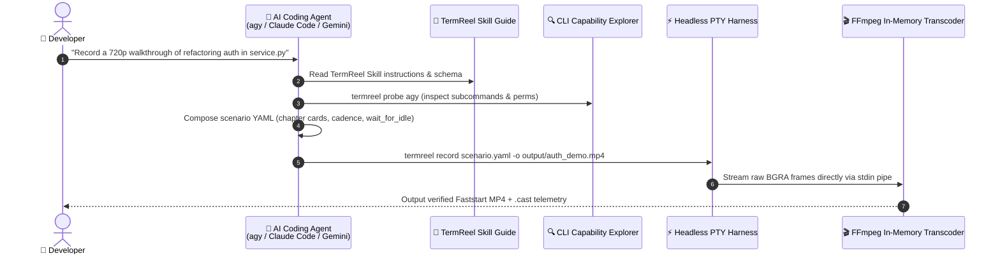

# Zero-YAML & Document-Driven Video Synthesis with AI Agents

TermReel was designed from the ground up to pair seamlessly with autonomous AI coding agents (such as **Antigravity `agy`**, **Claude Code**, **Gemini CLI**, **Cursor**, and **Aider**).

Through the **TermReel Agent Skill** (`skills/termreel/SKILL.md`), you can prompt your AI coding assistant in natural language or point it to a document, PR, or issue ticket. The agent reads the documentation, writes the scenario manifest, manages permissions, and produces verified video proof artifacts.

---

## The Agent Interaction Workflow



---

## 1. Natural Language Prompting Patterns

### A. Feature Demonstration Walkthrough
```
"Record a clean 30 FPS video in catppuccin-mocha demonstrating how to use our new CLI tool 'dataflow' to ingest a CSV file, run SQL transformations, and export Parquet. Include introductory chapter cards."
```

### B. Bug Reproduction & Verification Proof
```
"Reproduce issue #142 in a terminal video, apply the fix to auth_middleware.py, and record the test suite passing with green checkmarks."
```

### C. Session Resumption Walkthrough
```
"Resume our current Antigravity session using termreel --resume, ask the agent to write unit tests for the user model, and record the full interactive generation."
```

---

## 2. Document & PR-Driven Synthesis

You can attach or `@`-mention any documentation file in your project workspace:

### Referencing a Product Requirement Document (PRD)
> *"Read `@docs/PRD_ONBOARDING.md` and synthesize an interactive tutorial video showing a new user completing the CLI onboarding flow."*

### Referencing a Pull Request Description
> *"Read the changes described in `PR_DESCRIPTION.md` and generate a high-fidelity video showcasing the before-and-after CLI output for the release notes."*

---

## 3. How the Skill Teaches the Agent

When the agent activates the `termreel` skill, it receives deterministic instructions on:

1. **Workspace Safety**:
   Setting `create_temp_workspace: true` and adding initialization commands (`setup_commands`) so recordings run in isolated, reproducible sandboxes.
2. **Interactive UI Interception**:
   Configuring reactive triggers (`triggers`) to intercept workspace trust dialogs and `[y/N]` human-in-the-loop tool approvals without crashing or stalling.
3. **Dynamic Idle Waiting**:
   Using `wait_for_idle` instead of hardcoded sleeps so the recording stays perfectly synchronized with variable model generation latency.
4. **Visual Polish**:
   Adding title chapter cards (`show_card`), adjusting typing speed per character (`speed: 0.035`), and setting informative status bars (`set_statusbar`).

---

## 4. Example: Full Generated Scenario

Here is an example scenario generated autonomously by an AI agent when prompted to record an interactive refactoring demo:

```yaml
version: "1.0"

metadata:
  title: "Service Refactoring Walkthrough"
  subtitle: "Automated Error Handling & Type Annotations"
  output: "output/service_refactor.mp4"
  poster_output: "output/service_refactor_poster.png"
  resolution: [1280, 720]
  fps: 30
  theme: "catppuccin-mocha"
  statusbar_left: "Antigravity CLI | service.py"
  statusbar_right: "TermReel HD"

environment:
  create_temp_workspace: true
  auto_trust: true
  setup_commands:
    - "git init"
    - "echo 'def process(data): return data.strip()' > service.py"
    - "git add service.py && git commit -m 'Initial service'"

permissions:
  auto_approve: true
  allow_commands: ["python3", "pytest", "git"]
  allow_tools: ["run_command", "write_to_file", "read_file"]

triggers:
  - on_match: "Do you trust the contents of this project\\?|Yes, I trust"
    action: "Enter"
    once: true

timeline:
  - show_card:
      tag: "Demo"
      title: "Interactive Agent Walkthrough"
      desc: "Refactoring service.py to handle exceptions robustly"
      duration: 2.0

  - launch:
      command: "agy"
      wait_for_idle: true
      timeout: 20.0

  - type:
      text: "Refactor service.py to validate input types and catch ValueError"
      speed: 0.03
      send_key: "Enter"

  - wait_for_idle:
      timeout: 40.0
      reading_pause: 2.5

  - type:
      text: "/exit"
      send_key: "Enter"
      pause: 1.0

  - run_shell:
      command: "git diff"
      pause: 2.0

  - show_card:
      tag: "Complete"
      title: "Refactoring Verified"
      duration: 1.5
```
