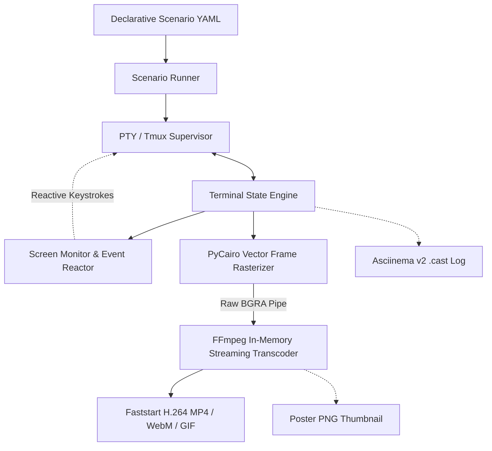

# TermReel: Universal Terminal Recording & Video Synthesis Engine

**TermReel** (`termreel` / `reccli`) is a standalone, headless CLI recording harness and deterministic video synthesis engine. It drives interactive command-line interfaces, terminal user interfaces (TUIs), and autonomous AI coding agents inside isolated pseudo-terminals (PTY/tmux), injects natural human-like keystrokes, reacts to live screen events, and streams pixel-perfect H.264 MP4 videos, animated GIFs, and Asciinema v2 (`.cast`) event streams directly into FFmpeg with **zero intermediate disk I/O**.

---

## Key Highlights

- **True Pseudo-Terminal (PTY) & Tmux Supervision**: Executes real binaries in authentic PTY environments with complete ANSI 256-color and 24-bit TrueColor RGB support.
- **Reactive UI & Modal Interception**: Intercepts workspace trust dialogs, model thinking spinners, and human-in-the-loop permission prompts without requiring YOLO flags or print modes.
- **Zero Intermediate Disk I/O**: Direct memory pipe streaming raw BGRA vector frames rendered by PyCairo directly into FFmpeg stdin.
- **Declarative YAML Scenarios**: Multi-step interactive workflows, chapter cards, dynamic status bars, and keystroke cadence simulation.
- **Automated CLI Exploration & Scaffolding**: `termreel probe` and `termreel generate` inspect target CLIs to auto-craft validated scenario manifests.
- **Dual Telemetry Export**: Simultaneously outputs standard MP4 videos, animated GIFs, PNG poster thumbnails, and Asciinema v2 (`.cast`) telemetry logs.
- **Token & Secret Redaction**: In-place regular expression masking for API keys, OAuth credentials, and private tokens.
- **Parallel Async Test Runner**: Fast test suite execution (`termreel test -w 8`).

---

## High-Level Architecture



---

## Quick Example

```bash
# 1. Probe a CLI tool
termreel probe git

# 2. Generate a tailored scenario YAML
termreel generate git -o scenarios/git_demo.yaml --theme tokyo-night

# 3. Record the high-fidelity video
termreel record scenarios/git_demo.yaml -o output/git_demo.mp4
```
