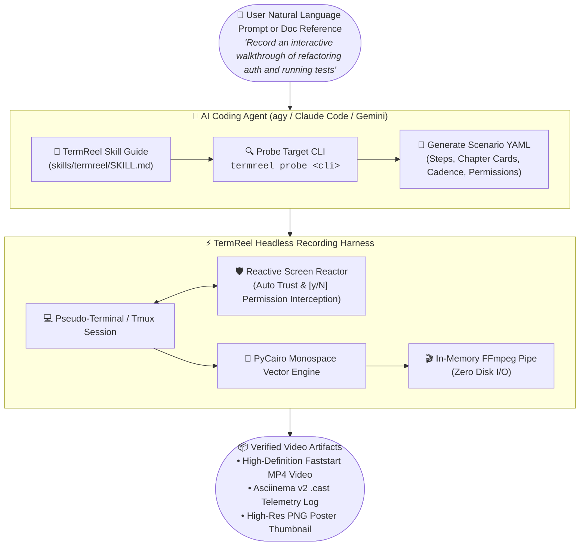

# TermReel Documentation

**TermReel** (`termreel` / `reccli`) is a standalone, headless CLI recording harness and deterministic video synthesis engine. It drives interactive command-line interfaces, terminal user interfaces (TUIs), and autonomous AI coding agents inside isolated pseudo-terminals (PTY/tmux), injects natural human-like keystrokes, reacts to live screen events, and streams pixel-perfect H.264 MP4 videos, animated GIFs, and Asciinema v2 (`.cast`) event streams directly into FFmpeg with **zero intermediate disk I/O**.

---

## Key Capabilities at a Glance

| Subsystem | Capability | Architectural Benefit |
| :--- | :--- | :--- |
| **Terminal Emulation** | 2D cell grid, 24-bit TrueColor RGB, ANSI 256-color, alternate screen buffers (`1049h/l`). | Pixel-accurate reproduction of modern TUIs with incremental UTF-8 stream decoding. |
| **PTY & Session Supervision** | POSIX `openpty()` and isolated `tmux` backend drivers with SIGWINCH propagation. | Executes real interactive binaries without requiring non-interactive print modes (`-p`). |
| **Reactive Screen Reactor** | Dynamic regex trigger engine with async keystroke dispatch. | Intercepts modal workspace trust prompts and `[y/N]` human approval dialogs automatically. |
| **Vector Rendering** | PyCairo sub-pixel font rasterizer with monospace text run batching. | 85–90% reduction in draw calls; crisp typography across 9 calibrated color palettes. |
| **Stream Transcoder** | Direct raw BGRA vector pipe to FFmpeg stdin with async background stderr draining. | Zero intermediate disk I/O; deadlock-free streaming with timed process reaping. |
| **CLI Explorer & Scaffolding**| Binary probing for subcommands, usage, and security permission boundaries. | Auto-scaffolds validated scenario YAML manifests (`termreel probe` / `termreel generate`). |
| **Session Resumption** | Multi-stage workflow checkpointing via `--resume` / `-c` and conversation ID tracking. | Seamlessly attaches to existing agent sessions without restarting the workspace. |
| **Batch Orchestrator** | Concurrently render multi-scenario test suites (`termreel batch`) with automatic poster frame sync. | Eliminates custom shell scripts; generates consolidated JSON and Markdown batch reports. |
| **Multimodal Video Audit** | Automated video evaluation via `gemini-3.1-pro-preview` with 100-point rubric (`termreel audit`). | Visual regression testing against scenario specs with automated CI pass/fail thresholding. |
| **Telemetry & Redaction** | Asciinema v2 (`.cast`) capture, PNG poster frame extraction, and automated token masking. | Lightweight audit logging with automated credential and secret masking. |

---

## 🤖 Using TermReel with AI Agents (`agy`, Claude Code, Gemini CLI)

TermReel includes an **Agent Skill** (`skills/termreel/SKILL.md` / `.agents/skills/termreel/SKILL.md`) that allows AI coding assistants to automatically script, record, and verify terminal videos directly from your high-level instructions.

---

## Explore the Documentation

-   :material-rocket-launch: **[Quickstart Guide](quickstart.md)**
    ---
    Install TermReel via binary, uv, or source and record your first video in under 60 seconds.

-   :material-robot: **[AI Agent Guide](guides/zero-yaml-agents.md)**
    ---
    Learn how to instruct AI coding agents in plain English or from design docs without writing YAML.

-   :material-code-json: **[Scenario Recipes](guides/recipes.md)**
    ---
    Copy-pasteable scenario manifests for Git, Python REPL, Docker builds, and Antigravity agents.

-   :material-console: **[CLI Reference](cli.md)**
    ---
    Full documentation of all CLI subcommands (`record`, `exec`, `probe`, `generate`, `cast2video`, `test`).

-   :material-palette: **[Themes & Palettes](themes.md)**
    ---
    Preview all 9 calibrated visual themes including Catppuccin, Tokyo Night, Dracula, and Nord.

-   :material-shield-check: **[Resilience Architecture](SDD_LONG_RUNNING_RESILIENCE.md)**
    ---
    Deep dive on watchdog heartbeat nudges, rolling lossless transcoders, and multi-step session resumption.

